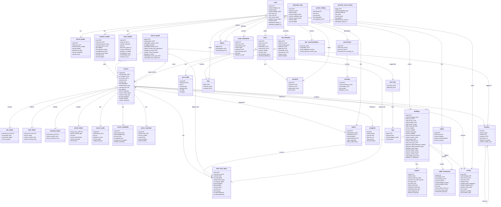

```mermaid
classDiagram
direction TB

%% ===================== CORE USER =====================
class users {
  +uuid id PK
  +varchar firebase_uid
  +varchar email
  +varchar display_name
  +text avatar_url
  +user_role role
  +user_status status
  +boolean social_active
  +varchar phone
  +timestamp created_at
  +timestamp updated_at
}

class tourist_profiles {
  +uuid id PK
  +uuid user_id FK
  +varchar phone_number
  +varchar gender
  +date date_of_birth
  +varchar nationality
  +varchar name
}

class provider_profiles {
  +uuid id PK
  +uuid user_id FK
  +varchar business_name
  +varchar business_type
  +text address
  +text rejection_reason
  +uuid approved_by FK
  +provider_status status
  +varchar phone
  +text description
}

class social_profiles {
  +uuid id PK
  +uuid user_id FK
  +varchar username
  +text bio
  +text cover_photo_url
  +varchar website_url
  +boolean is_verified
  +int followers_count
  +int following_count
  +int posts_count
}

%% ===================== SERVICES =====================
class services {
  +uuid id PK
  +uuid provider_id FK
  +int category_id FK
  +int location_id FK
  +varchar name
  +varchar slug
  +text description
  +numeric base_price
  +varchar price_unit
  +text address
  +service_type type
  +service_status status
  +numeric rating_avg
  +int total_bookings
  +numeric latitude
  +numeric longitude
}

class tour_details {
  +uuid service_id PK FK
  +int duration_days
  +int duration_nights
  +int max_guests
}

class hotel_details {
  +uuid service_id PK FK
  +int star_rating
  +varchar checkin_time
  +varchar checkout_time
}

class homestay_details {
  +uuid service_id PK FK
  +varchar checkin_time
  +varchar checkout_time
}

class vehicle_details {
  +uuid service_id PK FK
  +varchar vehicle_type
  +int seats
  +varchar transmission
  +varchar fuel_type
  +int inventory
}

class hotel_room_types {
  +uuid id PK
  +uuid service_id FK
  +varchar name
  +text description
  +numeric base_price
  +int capacity_adults
  +jsonb amenities
  +jsonb images
  +varchar status
  +varchar rank
  +int inventory
  +int total_bedrooms
  +int total_bathrooms
}

class service_media {
  +uuid id PK
  +uuid service_id FK
  +text url
  +boolean is_cover
  +int sort_order
  +media_type type
}

class service_availability {
  +uuid id PK
  +uuid service_id FK
  +date available_date
  +int total_slots
  +int booked_slots
  +numeric price_override
  +boolean is_blocked
}

class service_schedules {
  +uuid id PK
  +uuid service_id FK
  +int day_number
  +varchar title
  +text description
  +jsonb activities
}

class service_upsells {
  +bigint id PK
  +uuid provider_id FK
  +uuid trigger_service_id FK
  +int trigger_quantity
  +uuid target_service_id FK
  +numeric upsell_price_adjustment
  +uuid perk_service_id FK
  +int perk_discount_percent
  +boolean is_active
  +uuid trigger_room_type_id FK
  +uuid target_room_type_id FK
}

%% ===================== BOOKING & PAYMENT =====================
class bookings {
  +uuid id PK
  +varchar booking_code
  +uuid user_id FK
  +uuid service_id FK
  +uuid provider_id FK
  +date check_in_date
  +date check_out_date
  +int num_adults
  +int num_children
  +numeric unit_price
  +numeric subtotal
  +numeric discount_amount
  +varchar coupon_code
  +uuid coupon_id FK
  +numeric total_amount
  +uuid room_type_id FK
  +payment_method payment_method
  +payment_status payment_status
  +booking_status status
  +varchar contact_name
  +varchar contact_phone
  +varchar contact_email
  +uuid affiliate_post_id FK
  +boolean is_checked_in
}

class coupons {
  +uuid id PK
  +varchar code
  +numeric discount_value
  +numeric min_order_amount
  +int usage_limit
  +int used_count
  +int per_user_limit
  +timestamp valid_from
  +timestamp valid_until
  +uuid created_by FK
  +discount_type type
}

class wallets {
  +uuid id PK
  +uuid user_id FK
  +numeric balance
  +numeric locked_balance
  +varchar currency
}

class wallet_transactions {
  +uuid id PK
  +uuid wallet_id FK
  +uuid booking_id FK
  +numeric amount
  +numeric balance_before
  +numeric balance_after
  +text note
  +varchar momo_trans_id
  +int momo_result_code
  +transaction_type type
}

%% ===================== SOCIAL =====================
class posts {
  +uuid id PK
  +uuid user_id FK
  +text content
  +int location_id FK
  +uuid service_id FK
  +varchar visibility
  +int likes_count
  +int comments_count
  +timestamp deleted_at
}

class post_media {
  +uuid id PK
  +uuid post_id FK
  +text url
  +varchar type
  +smallint order
  +int width
  +int height
}

class post_tags {
  +uuid post_id FK
  +bigint tag_id FK
}

class likes {
  +bigint id PK
  +uuid user_id FK
  +uuid post_id FK
}

class comments {
  +uuid id PK
  +uuid post_id FK
  +uuid user_id FK
  +uuid service_id FK
  +text content
}

class follows {
  +bigint id PK
  +uuid follower_id FK
  +uuid following_id FK
}

class social_notifications {
  +uuid id PK
  +uuid user_id FK
  +uuid sender_id FK
  +varchar type
  +uuid post_id FK
  +uuid comment_id FK
  +text data
  +boolean is_read
}

%% ===================== MESSAGING =====================
class conversations {
  +uuid id PK
  +uuid user_one FK
  +uuid user_two FK
  +timestamp last_message_at
}

class messages {
  +uuid id PK
  +uuid conversation_id FK
  +uuid sender_id FK
  +text content
  +boolean is_read
}

%% ===================== REVIEW & REPORT =====================
class reviews {
  +uuid id PK
  +uuid booking_id FK
  +uuid service_id FK
  +uuid user_id FK
  +smallint rating
  +smallint rating_cleanliness
  +smallint rating_service
  +smallint rating_value
  +text content
  +boolean is_verified
  +text provider_reply
}

class reports {
  +uuid id PK
  +uuid reporter_id FK
  +uuid service_id FK
  +text description
  +uuid reviewed_by FK
  +report_type type
  +report_status status
}

%% ===================== CATALOG =====================
class categories {
  +int id PK
  +varchar name
  +varchar slug
  +text icon_url
  +varchar icon
  +text description
}

class locations {
  +int id PK
  +varchar name
  +varchar slug
  +int parent_id FK
  +text image_url
  +boolean is_popular
  +varchar country_code
}

class tags {
  +bigint id PK
  +varchar name
  +varchar display_name
  +varchar type
}

%% ===================== ANALYTICS =====================
class user_behaviors {
  +bigint id PK
  +uuid user_id FK
  +varchar action_type
  +uuid post_id FK
  +bigint tag_id FK
  +int location_id FK
  +uuid service_id FK
  +numeric score
  +jsonb metadata
}

class user_recommendations {
  +uuid user_id FK
  +int location_id FK
  +jsonb suggested_services
  +service_type last_anchor_type
}

class automation_logs {
  +uuid id PK
  +uuid user_id FK
  +varchar email
  +varchar display_name
  +varchar campaign_type
  +varchar service_name
  +varchar status
  +json metadata
}

%% ===================== SYSTEM =====================
class system_settings {
  +varchar key PK
  +text value
  +varchar type
  +text description
  +uuid updated_by FK
}

class personal_access_tokens {
  +bigint id PK
  +varchar tokenable_type
  +uuid tokenable_id
  +text name
  +varchar token
  +text abilities
  +timestamp last_used_at
  +timestamp expires_at
}

%% ===================== RELATIONSHIPS =====================

%% User → Profiles
users "1" --> "0..1" tourist_profiles : has
users "1" --> "0..1" provider_profiles : has
users "1" --> "0..1" social_profiles : has
users "1" --> "0..1" wallets : has

%% Provider → Services
provider_profiles "1" --> "0..*" services : owns
services "0..1" --> "1" categories : belongs to
services "0..1" --> "1" locations : located in

%% Service subtypes (1-to-1)
services "1" --> "0..1" tour_details : extends
services "1" --> "0..1" hotel_details : extends
services "1" --> "0..1" homestay_details : extends
services "1" --> "0..1" vehicle_details : extends

%% Service children
services "1" --> "0..*" hotel_room_types : has
services "1" --> "0..*" service_media : has
services "1" --> "0..*" service_availability : has
services "1" --> "0..*" service_schedules : has

%% Bookings
users "1" --> "0..*" bookings : makes
services "1" --> "0..*" bookings : booked via
bookings "0..*" --> "0..1" coupons : uses
bookings "0..1" --> "0..1" hotel_room_types : for room

%% Payment
wallets "1" --> "0..*" wallet_transactions : records
bookings "1" --> "0..*" wallet_transactions : paid by

%% Reviews & Reports
bookings "1" --> "0..1" reviews : triggers
services "1" --> "0..*" reviews : receives
users "1" --> "0..*" reviews : writes
services "1" --> "0..*" reports : reported via
users "1" --> "0..*" reports : files

%% Upsells
service_upsells "0..*" --> "1" services : trigger_service
service_upsells "0..*" --> "1" services : target_service
service_upsells "0..*" --> "0..1" hotel_room_types : trigger_room
service_upsells "0..*" --> "0..1" hotel_room_types : target_room

%% Social
users "1" --> "0..*" posts : writes
posts "1" --> "0..*" post_media : has
posts "1" --> "0..*" post_tags : tagged with
post_tags "0..*" --> "1" tags : uses
posts "1" --> "0..*" likes : receives
posts "1" --> "0..*" comments : has
users "1" --> "0..*" likes : gives
users "1" --> "0..*" comments : writes
users "1" --> "0..*" follows : follower
users "1" --> "0..*" follows : following
posts "0..*" --> "0..1" locations : tagged at
posts "0..*" --> "0..1" services : about

%% Notifications & Messaging
users "1" --> "0..*" social_notifications : receives
users "1" --> "0..*" conversations : participates
conversations "1" --> "0..*" messages : contains

%% Behaviors & Recommendations
users "1" --> "0..*" user_behaviors : generates
users "1" --> "0..*" user_recommendations : receives

%% Location self-ref
locations "0..1" --> "0..*" locations : parent of
```